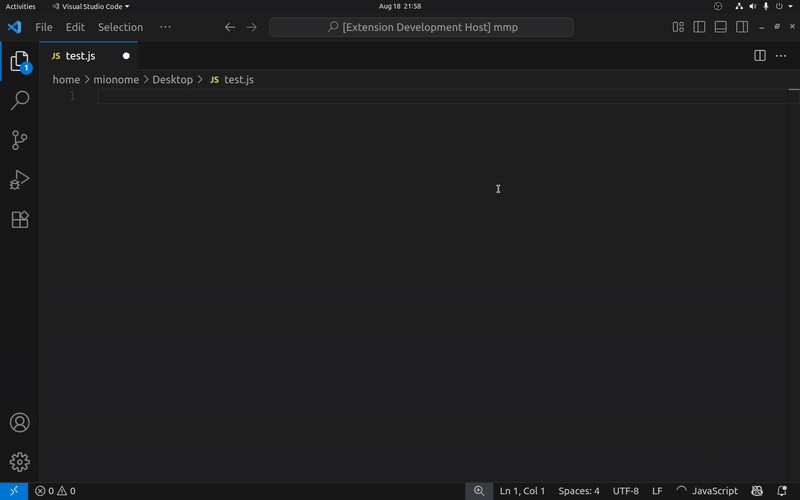
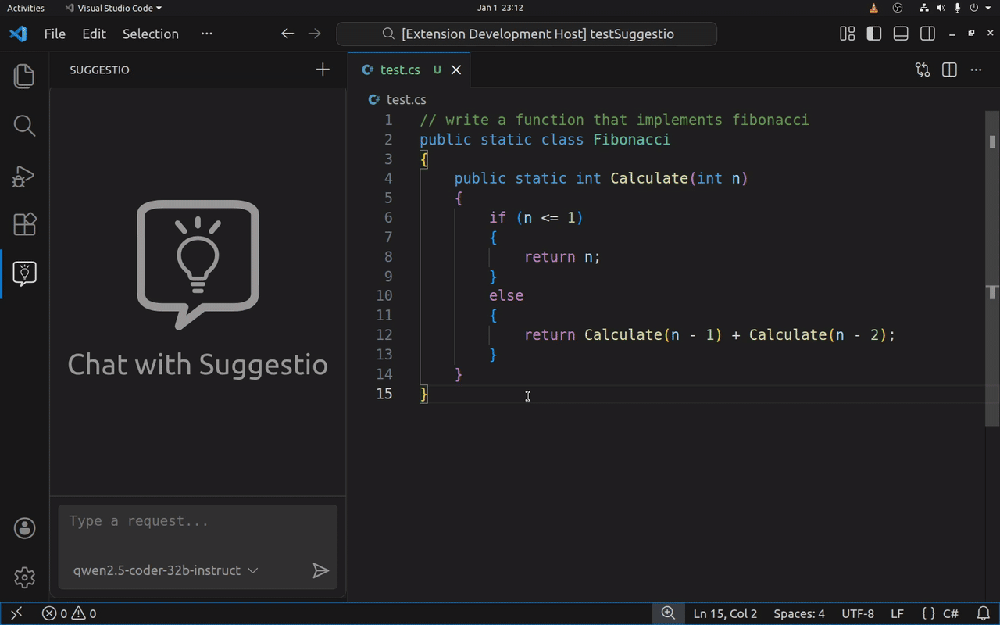

<div align="center">
  
  <h1>Suggestio</h1>
  <p>AI-Powered Inline Suggestions & Chat Assistant</p>
</div>

**Suggestio** is a VS Code extension that provides inline code completions and a context-aware chat assistant using LLM (Large Language Model) APIs.  
It’s lightweight, open-source, and does not require login, cloud accounts, or API keys — it works out of the box.  
(You can optionally configure your own providers and API keys if you want more control.)



---

## ✨ Features

- **Inline code suggestions** as you type, powered by configurable LLM providers.  
- **Interactive Chat Sidebar:** A dedicated AI assistant that answers questions, explains code, and writes snippets.
- **Smart Context:** The chat assistant automatically tracks your **active editor** to give relevant answers.
- **Works out of the box — no API key required.**
- Automatic **secret management**: if an API key is missing, Suggestio securely prompts you once and stores it in VS Code’s secret storage.  
- Built-in **anonymizer**: automatically masks sensitive data (emails, tokens, IDs, etc.) before sending prompts to providers.  
- **Entropy-based Secret Detection:** Mathematically detects and hides high-entropy strings (potential API keys/secrets) even if they aren't explicitly listed.
- Supports multiple providers/models (Ollama, Gemini, OpenAI, Groq, etc.) — add your own with simple JSON config.  
- Three levels of configuration (project, user, built-in defaults).   

---

## 💬 Interactive Chat

Suggestio now features a **"Suggestio" sidebar view** (click the lightbulb icon in your activity bar).

- **Context Aware:** It knows which file you are currently looking at and uses it as context for your questions.
- **Privacy First:** Just like inline completions, the chat uses the **Anonymizer** to mask sensitive data before it leaves your machine.
- **Streaming:** Responses are streamed token-by-token for immediate feedback.
- **History:** Keeps your conversation history (until you clear it with the "New Chat" command).




---

## 🔒 Anonymizer

To protect your privacy, Suggestio includes a built-in **anonymizer**:  
it automatically masks sensitive values such as emails, tokens, file paths, and IDs before sending text to external LLM providers.  

The anonymizer uses a multi-layered approach:
1.  **Explicit List:** Replaces words and patterns explicitly listed in your config file.
2.  **Entropy Analysis:** Uses Shannon entropy to detect random-looking strings (like API keys or passwords) that you might have forgotten to configure.
3.  **Heuristics:** Automatically detects file paths and common identifiers, to avoid false positives.

All terms that are anonymized in the outgoing prompt are **deanonymized when the response comes back**, so the completion or chat response you see in your editor always contains your original values.

---

## 🚀 Installation

1. Install **Suggestio** from the [VS Code Marketplace](https://marketplace.visualstudio.com/).  
2. Start coding — completions will appear inline.
3. Click the **Suggestio icon** in the sidebar to start chatting.
4. (Optional) Configure your own providers and models (see below).

---

## ⚙️ Configuration

Suggestio loads its configuration (`config.json`) from **three possible locations**, in priority order:

### 1. Workspace Config (highest priority)
If your project has a file named:

```
suggestio.config.json
```

in the **root of the workspace**, Suggestio will load providers/models from there.  
Use this when different projects need different LLM setups.  

### 2. Global Config (user-wide)
If you create a file:

```
<globalStorage>/glacode.suggestio/config.json
```

(where `<globalStorage>` is VS Code’s private data folder), Suggestio will load that.  
This applies to **all your projects**, unless a workspace config overrides it.  

👉 To make this easier, Suggestio provides a command:

- **Suggestio: Edit Global Config** — creates/opens your global `config.json` so you can edit it directly.

### 3. Built-in Defaults (fallback)
If neither workspace nor global config exists, Suggestio falls back to the **bundled config.json** shipped with the extension.  
This guarantees Suggestio works immediately after install.

---

## 🧩 Example Config

Here’s a minimal example of a config file:

```json
{
  "activeProvider": "llm7-qwen32",
  "providers": {
    "llm7-qwen32": {
      "endpoint": "https://api.llm7.io/v1/chat/completions",
      "model": "qwen2.5-coder-32b-instruct",
      "apiKey": "unused"
    },
    "publicai-apertus-70b": {
      "endpoint": "https://api.publicai.co/v1/chat/completions",
      "model": "swiss-ai/apertus-70b-instruct",
      "apiKey": "${PUBLICAI_API_KEY}"
    },
    "groq-llama370": {
      "endpoint": "https://api.groq.com/openai/v1/chat/completions",
      "model": "llama-3.3-70b-versatile",
      "apiKey": "${GROQ_API_KEY}"
    },
    "ollama-devstral": {
      "endpoint": "https://ollama.com/v1/chat/completions",
      "model": "devstral-2:123b-cloud",
      "apiKey": "${OLLAMA_API_KEY}"
    },
    "ollama-gpt-oss-120b": {
      "endpoint": "https://ollama.com/v1/chat/completions",
      "model": "gpt-oss:120b-cloud",
      "apiKey": "${OLLAMA_API_KEY}"
    }
  },
  "anonymizer": {
    "enabled": true,
    "words": [
      "john",
      "doe",
      "john.doe@example.com",
      "192.168.1.1",
      "<social_security_number>",
      "<street_address>"
    ],
    "sensitiveData": {
      "allowedEntropy": 0.85,
      "minLength": 10
    }
  }
}
```

You can reference environment variables in your config, e.g.:

```json
{
  "apiKey": "${OPENROUTER_API_KEY}"
}
```

---

## 📂 Where is the Global Config Folder?

VS Code stores global extension data in different places depending on your OS:

- **Linux:** `~/.config/Code/User/globalStorage/glacode.suggestio/`
- **macOS:** `~/Library/Application Support/Code/User/globalStorage/glacode.suggestio/`
- **Windows:** `%APPDATA%\Code\User\globalStorage\glacode.suggestio\`

You usually don’t need to remember this path — just use **Suggestio: Edit Global Config** from the command palette.

---

## 🔑 API Keys & Secret Management

- By default, Suggestio works without API keys (using built-in providers).  
- If a provider requires an API key:
  - Suggestio first tries to load it from environment variables.  
  - If it’s not found, Suggestio will securely **prompt you once** for the key and save it in VS Code’s [Secret Storage](https://code.visualstudio.com/api/references/vscode-api#SecretStorage).  
- Never hardcode API keys into workspace configs if you share the repo.  

---

## 🛠 Development

To hack on Suggestio locally:

```bash
git clone https://github.com/glacode/suggestio.git
cd suggestio
npm install
npm run compile
```

Then press `F5` in VS Code to launch a new window with the extension loaded.  

---

## 📜 License

MIT © [Glauco Siliprandi](https://github.com/glacode)
