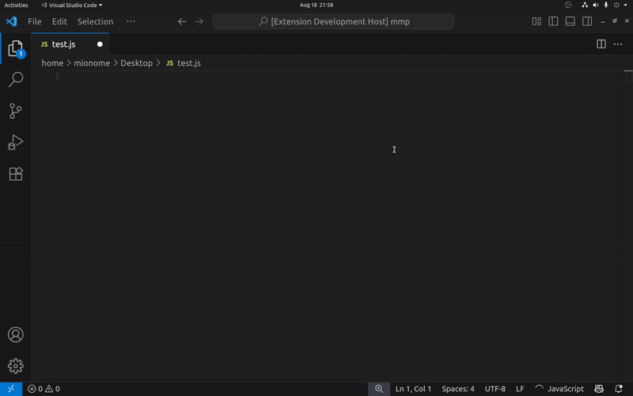
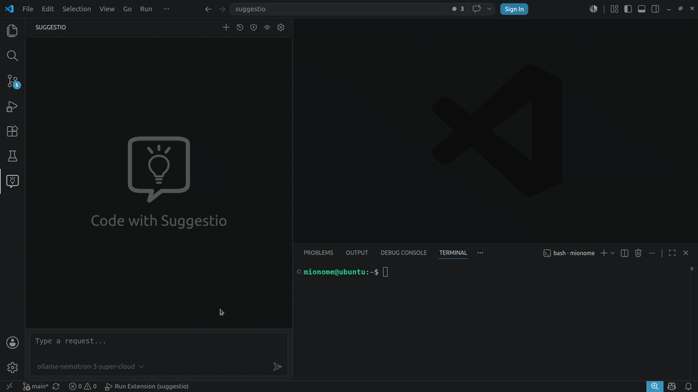

<div align="center">
  
  <h1>Suggestio</h1>
  <p><strong>Autonomous coding agent using free LLM Providers.</strong></p>
</div>

**Suggestio** is an open-source coding assistant for VS Code designed for developers and students who want to use powerful AI without expensive subscriptions. It is specifically built to work with **free LLM tiers** (like Gemini, OpenRouter, Mistral) that don't require credit card information to get started.


---

## The Autonomous Agent

The core of Suggestio is an **autonomous agent** that can help you solve complex tasks by using tools to navigate and modify your project:

- **Search & Explore:** Automatically uses `grep` to find code and lists files to understand your project structure.
- **Surgical Edits:** Can propose precise changes to your files. You review every change in a **native side-by-side diff** before accepting.
- **Shell Integration:** Can run tests, build commands, or linters to verify its own work.
- **Reasoning Support:** Optimized for "reasoning" models so you can see the agent's step-by-step thought process.
- **Lightweight Design:** With an installed size of less than 3MB, Suggestio provides full agentic power with minimal resource consumption.

## ✍️ Inline Completions

Suggestio also provides **ghost-text completions** as you type. It’s lightweight and designed to provide helpful suggestions based on your current file context. You can use different models for chat and completions to balance speed and intelligence.



---

## ⚙️ Quick Start

You just need a free API key from a provider like [Google Gemini](https://aistudio.google.com/) or [Mistral](https://mistral.ai/).

1. **Install** Suggestio from the VS Code Marketplace.
2. **Open the Sidebar:** Click the Suggestio icon (the lightbulb).
3. **Add your Key:** Click the **Gear icon** (Settings) in the chat view.
4. **Paste & Go:** Select a profile, paste your API key, and you're ready to code.



---

## 🔒 Privacy & Security

- **Agent Guardrails:** Every file modification or shell command requires your explicit approval (unless you enable "Always Allow" for specific tools).
- **Experimental Anonymizer:** (Disabled by default) Mathematically detects and masks sensitive data (API keys, tokens) using Shannon entropy analysis before it leaves your machine.
- **Local Secret Storage:** API keys are never stored in your project files. They are managed securely via VS Code's native Secret Storage.

---

## 💡 Recommended Free Tier Models

Suggestio is designed to leverage providers that offer generous free tiers. Here are our current recommendations for high-quality models that can be used without a paid subscription:

- **Google Gemini (Gemma 4 31B):** A reliable daily driver offering a generous free tier of 1,500 requests per day and 15 requests per minute, with no specific limitations on tokens per minute.
- **Mistral Devstral:** Mistral has consistently offered free access to their specialized coding models, including Devstral 2512 (Large) and Devstral Small 2512. Both are exceptionally fast and capable.
- **Stepfun Step 3.5 Flash (via NVIDIA NIM):** Available through NVIDIA's free endpoint registry. This model utilizes a sparse Mixture-of-Experts (MoE) architecture with ~11B active parameters per token, providing very low latency and fast token generation alongside support for tool-calling and agentic tasks.
- **llm7.io (No API Key Required):** You can use the Qwen3-235B model via llm7.io to test Suggestio's agentic features immediately without an API key. While not intended for heavy production use, it provides an effortless way to explore the extension.

---

## Advanced Configuration

While you can do most things through the UI, Suggestio supports a layered configuration system for power users:

- **Suggestio: Edit Global Config**: Opens a JSON file for advanced profile management.
- **Project Config**: Create a `suggestio.config.json` in your root folder to share model settings (but not keys!) with your teammates.

---

## 🛠 Development

To hack on Suggestio locally:

```bash
git clone https://github.com/glacode/suggestio.git
cd suggestio
npm install
npm run compile
```

Then press `F5` in VS Code to launch a new window with the extension loaded.

---

## 📜 License

MIT © [Glauco Siliprandi](https://github.com/glacode)
