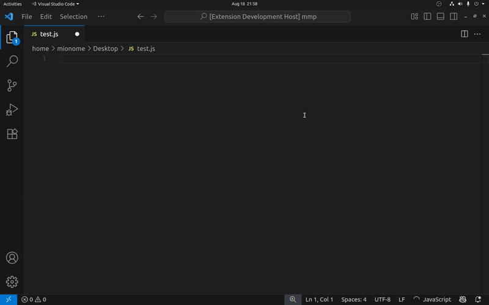
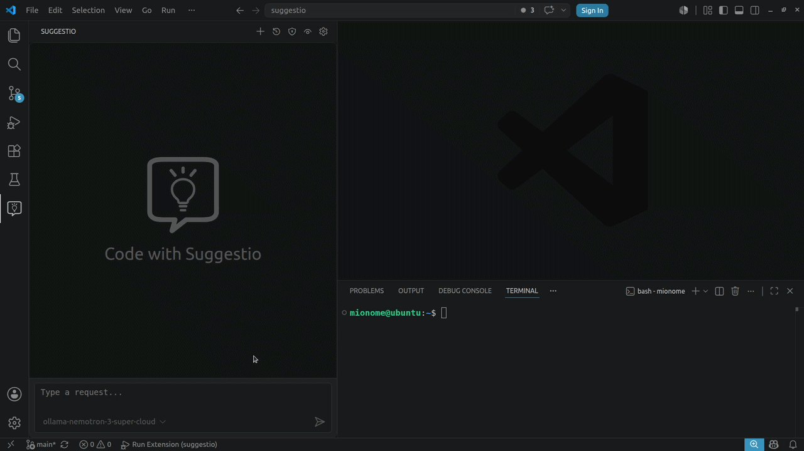

<div align="center">
  
  <h1>Suggestio</h1>
  <p><strong>Autonomous coding agent using free LLM Providers.</strong></p>
</div>

**Suggestio** is an open-source coding assistant for VS Code designed for developers and students who want to use powerful AI without expensive subscriptions. It is specifically built to work with **free LLM tiers** (like Gemini, OpenRouter, Mistral) that don't require credit card information to get started.


---

## The Autonomous Agent

The core of Suggestio is an **autonomous agent** that can help you solve complex tasks by using tools to navigate and modify your project:

- **Search & Explore:** Automatically uses `grep` to find code and lists files to understand your project structure.
- **Surgical Edits:** Can propose precise changes to your files. You review every change in a **native side-by-side diff** before accepting.
- **Shell Integration:** Can run tests, build commands, or linters to verify its own work.
- **Reasoning Support:** Optimized for "reasoning" models so you can see the agent's step-by-step thought process.
- **Continue a Stalled Response:** If the model stops before finishing — cancelled, errored, or cut off mid-answer — press **Enter** (or click the **send icon**) with an empty input to continue the last response from the existing conversation, no new prompt needed.
- **Lightweight Design:** With an installed size of less than 3MB, Suggestio provides full agentic power with minimal resource consumption.

## ✍️ Inline Completions

Suggestio also provides **ghost-text completions** as you type. It’s lightweight and designed to provide helpful suggestions based on your current file context. You can use different models for chat and completions to balance speed and intelligence.



---

## ⚙️ Quick Start

You just need a free API key from a provider like [Google Gemini](https://aistudio.google.com/) or [Mistral](https://mistral.ai/).

1. **Install** Suggestio from the VS Code Marketplace.
2. **Open the Sidebar:** Click the Suggestio icon (the lightbulb).
3. **Add your Key:** Click the **Gear icon** (Settings) in the chat view.
4. **Paste & Go:** Select a profile, paste your API key, and you're ready to code.



---

## 🔒 Privacy & Security

- **Agent Guardrails:** Every file modification or shell command requires your explicit approval (unless you enable "Always Allow" for specific tools).
- **Experimental Anonymizer:** (Disabled by default) Mathematically detects and masks sensitive data (API keys, tokens) using Shannon entropy analysis before it leaves your machine.
- **Local Secret Storage:** API keys are never stored in your project files. They are managed securely via VS Code's native Secret Storage.

---

## 💡 Recommended Free Tier Models

Suggestio is designed to leverage providers that offer generous free tiers. Here are our current recommendations for high-quality models that can be used without a paid subscription:

- **Google Gemini 3.5 Flash Lite (default chat profile):** A lightweight, fast Gemini tier with native tool-calling support and now Suggestio's default active chat profile — great for quick agentic tasks.
- **Qwen 3.8 27B (via Groq):** The default inline completion profile and the strongest completion quality we've measured so far — a fast, free coding model on Groq's free tier.
- **Meta Muse Glimmer 30B (via NVIDIA NIM):** Available through NVIDIA's free endpoint registry, with low-latency generation and tool-calling support for agentic tasks.
- **Z.ai GLM 4.7 Flash:** A fast free coding model from Zhipu AI, ready out of the box with tool-calling support.
- **Cohere North Mini Code & Nex AGI N2.5 Pro (via OpenRouter):** Free coding-specialized models now included in the profile list.
- **llm7.io (No API Key Required):** You can use the predefined models available via llm7.io to immediately test Suggestio's agentic features without an API key. While not intended for heavy production use, they provide an effortless way to explore the extension.

---

## Advanced Configuration

While you can do most things through the UI, Suggestio supports a layered configuration system for power users:

- **Suggestio: Edit Global Config**: Opens a JSON file for advanced profile management.
- **Project Config**: Create a `suggestio.config.json` in your root folder to share model settings (but not keys!) with your teammates.

---

## 🛠 Development

To hack on Suggestio locally:

```bash
git clone https://github.com/glacode/suggestio.git
cd suggestio
npm install
npm run compile
```

Then press `F5` in VS Code to launch a new window with the extension loaded.

---

## 📜 License

MIT © [Glauco Siliprandi](https://github.com/glacode)
